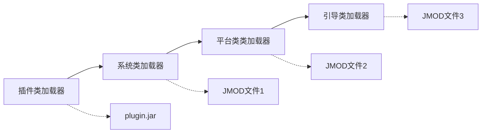

1. MyProgram.class，虚拟机执行的步骤

- 虚拟机有一个用于加载类文件的机制，例如，从磁盘上读取文件或者请求 Web 上的文件，它使用该机制来加载 MyProgram 类文件中的内容
- 如果 MyProgram 类拥有类型为另一个类的域，或者是拥有超类，那么这些类文件也会被加载。加载某个类所依赖的所有类的过程称为类的解析
- 接着，虚拟机执行 MyProgram 中的 main 方法（它是静态的，无须创建类的实例）
- 如果 main 方法或者 main 调用的方法要用到更多的类，那么接下来就会加载这些类

2. 类加载器

> 类加载机制并非只使用单个的类加载器。每个 Java 程序至少拥有三个类加载器

- 引导类加载器
  > 引导类加载器负责加载包含下列模块以及大量的 JDK 内部模块中的平台类。引导类加载器没有对应的 ClassLoader 对象

  ```java
    // 返回 null
    StringBuilder.class.getClassLoader()
  ```

  - java.base
  - java.datatransfer
  - java.desktop
  - java.instrument
  - java.logging
  - java.management
  - java.management.rmi
  - java.naming
  - java.prefs
  - java.rmi
  - java.security.sasl
  - java.xml

- 平台类加载器

> 平台类加载器会加载引导类加载器没有加载的 Java 平台中的所有类

- 系统类加载器（有时也被称为应用类加载器）

> 系统类加载器会从模块路径和类路径中加载应用类

3. 类加载器的层次结构

> 类加载器有一种父/子关系。除了引导类加载器外，每个类加载器都有一个父类加载器。类加载器会为它的父类加载器提供一个机会，以便加载任何给定的类，并且只有在其父类加载器加载失败时，它才会加载该给定类。
> 例如，当要求系统类加载器加载一个系统类（比如，java.lang.StringBuilder）时，它首先要求平台类加载器进行加载，该加载器则首先要求引导类加载器进行加载。引导类加载器会找到并加载这个类，而无需其他类加载器做更多的搜索。




4. 需要干涉和指定类加载器的情况

- 你的应用的代码包含一个助手方法，它要调用 class.forName(classNameString)
- 这个方法是从一个插件类中被调用的
- classNameString 指定的正是一个包含在这个插件的 JAR 中的类

> 插件的作者期望这个类会被加载。但是，助手方法的类是由系统类加载器加载的，这正是 Class.forName 所使用的类加载器。
> 而对于它来说，插件 JAR 中的类是不可见的，这种现象称为类加载器倒置。（JAR中的类是由插件类加载器加载的，应用代码调用 class.forName 会使用系统类加载器查找该类，父类加载器不能加载子类加载器的类，所以是不可见的）

5. 编写自己的类加载器

> ClassLoader 超类的 loadClass 方法用于将类的加载操作委托给其父类加载器去进行，只有当该类尚未加载并且父类加载器也无法加载该时候，才调用 findClass 方法

- 为来自本地文件系统或者其他来源的类加载其字节码
- 调用 ClassLoader 超类的 defineClass 方法，向虚拟机提供字节码