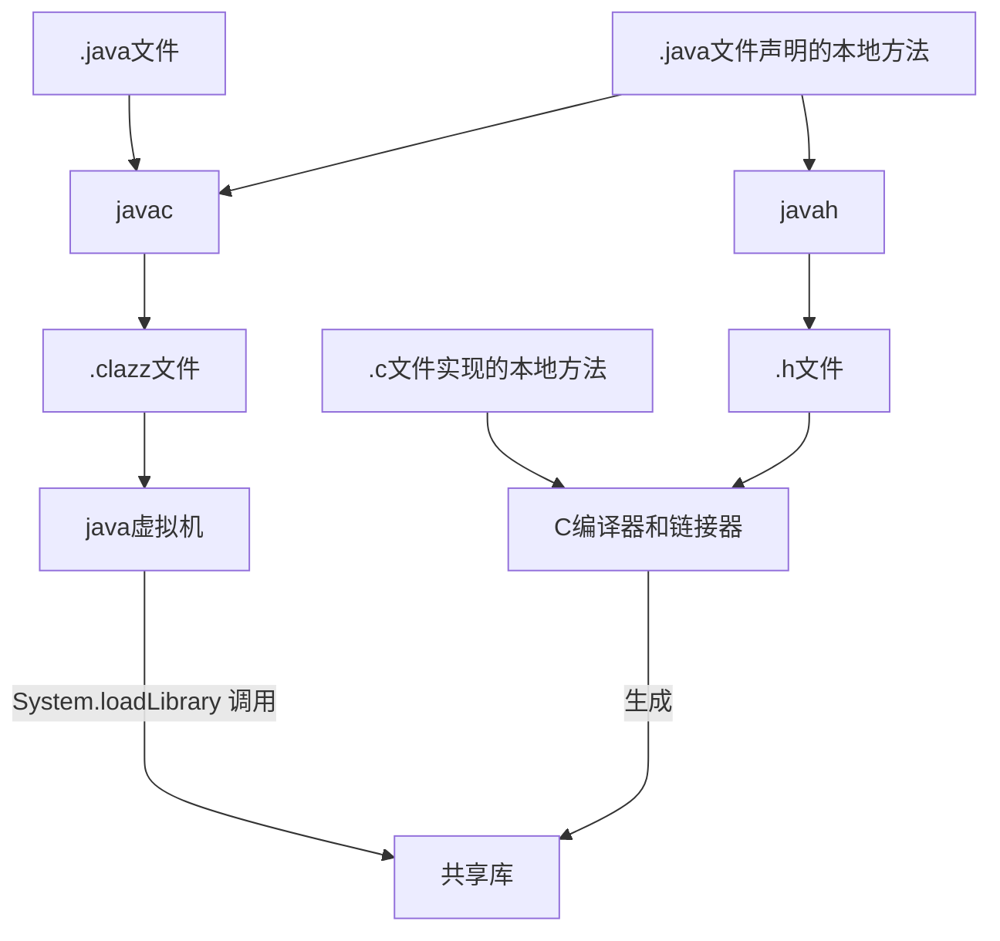
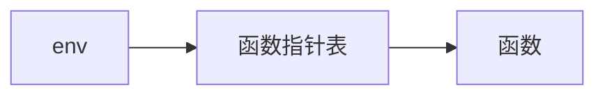

1. [本地代码处理流程](https://mermaid-js.github.io/mermaid/#/flowchart）

- 在 Java 类中声明一个本地方法
- 运行 javah 以获得包含该方法的 C 声明的头文件
- 用 C 实现该本地方法
- 将代码置于共享类库中
- 在 Java 程序中加载该类库



2. Java数据类型和C数据类型

> 当在C和Java之间传递数字时候，应该知道它们彼此之间的对应类型。C在一些平台上，int类型是16位的，在另外一些平台是32位的。然而，Java的int类型总是32位的整数
> 在头文件jni.h中，以下这些类型被 typedef 语句声明为在目标平台上等价的类型

| Java 编程语言 | C编程语言 | 字节  |
| :-----------: | :-------: | :---: |
|    boolean    | jboolean  |   1   |
|     byte      |   jbyte   |   1   |
|     char      |   jchar   |   2   |
|     short     |  jshort   |   2   |
|      int      |   jint    |   4   |
|     long      |   jlong   |   8   |
|     float     |  jfloat   |   4   |
|    double     |  jdouble  |   8   |


3. 字符串参数

> Java编程语言中的字符串是 UTF-16 编码点的序列，而C的字符串则是以null结尾的字节序列。
> JNI有两组操作字符串的函数，一组把Java字符串转换成“modified UTF-8”字节序列，另一组将它们转换成 UTF-16 数值的数组，也就是说转换成 jchar 数组。

4. env指针

> 所有对JNI函数的调用都使用到了env指针，该指针是每一个本地方法的第一个参数。env指针是指向函数指针表的指针。
> 所以，你必须在每个JNI调用前面加上 (*env)->，以便解析对函数指针的引用。而且，env是每个JNI函数的第一个参数

> (*env)获取env指针的指向的值




5. 编码签名
   
|    签名     |   类型   |
| :---------: | :------: |
|      B      |   byte   |
|      C      |   char   |
|      D      |  double  |
|      F      |  float   |
|      I      |   int    |
|      J      |   long   |
| Lclassname; | 类的类型 |
|      S      |  short   |
|      V      |   void   |
|      Z      | boolean  |

```java
// 字符串数组
[Ljava/lang/String

// float[][]
[[F

// 接收两个整型参数并返回一个整数的方法
(II)I

// Sprint 方法混编签名
(Ljava/lang/String;D)Ljava/lang/String

// 构造器 Employee(java.lang.String, double, java.util.Date)
// DLjava/util/Date; 之间没有分隔符
(Ljava/lang/String;DLjava/util/Date;)V

```

```shell
# 从类文件中产生方法签名
javap -s -private Employee
```

6. Java数组类型和C数组类型

> 在 C 中，所有这些数组类型实际上都是 jobject 的同义类型。然而，在 C++ 中它们被安排在继承层次结构中。jarray 类型表示一个泛型数组。

| Java数组类型 |   C数组类型   |
| :----------: | :-----------: |
|  boolean[]   | jbooleanArray |
|    byte[]    |  jbyteArray   |
|    char[]    |  jcharArray   |
|    int[]     |   jintArray   |
|   short[]    |  jshortArray  |
|    long[]    |  jlongArray   |
|   float[]    |  jfloatArray  |
|   double[]   | jdoubleArray  |
|   Object[]   | jobjectArray  |


7. 初始化虚拟机所需的基本代码

```c++
JavaVMOption options[1];
JavaVMInitArgs vm_args;
JavaVM *jvm;
JNIEnv *env;

options[0].optionString = "-Djava.library.path=.";
memset(&vm_args, 0, sizeof(vm_args));
vm_args.version = JNI_VERSION_1_2;
// 可以给虚拟机提供任意数目的选项，只需要增加选项数组的大小和 vm_args.nOptions 的值
vm_args.nOptions = 1;
vm_args.options = options;

JNI_CreateJavaVM(&jvm, (void**)&env, &vm_args);
```

```cpp
// 当你陷入麻烦导致程序崩溃，从而不能初始化 JVM 或者不能装载你的类时候，请打开 JNI 调试模式。
// 你会看到一系列说明 JVM 初始化进程的消息。如果看不到你装载的类，请检查你的路径和类路径的设置
options[i].optionString = "-verbose:jni";
```